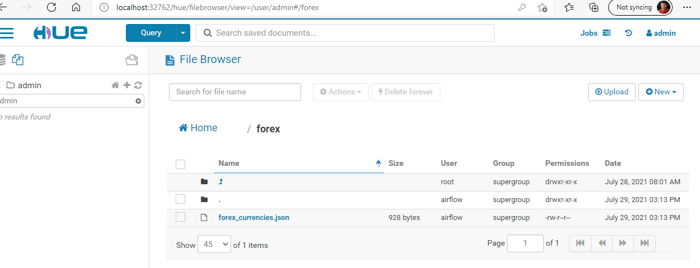
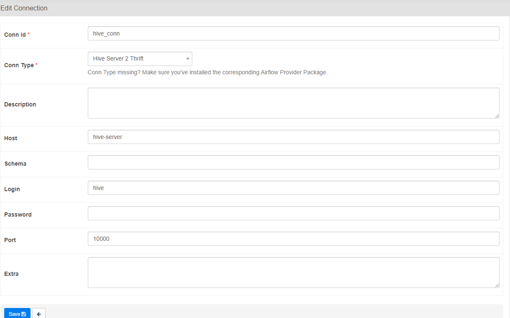

# Forex-Currency-Processing-Airflow-Hdfs-Hive-Spark
We  build a Forex-currency rates pipeline to get currency rates from an external API and load the data into HDFS from where we use pyspark job to massage the data, insert it into a Hive table and send out an email notification once complete. The objective of this pipeline is to get the data ready for any downstream machine learning pipeline.

## Project Description

A currency trading company is interested to leverage ML models to predict fluctuations in currency rates,
to enable this it is required to build a pipeline which fetches forex currency trade rates daily and dumps them 
into a table.

## Data Description

To get the data we would be using an external API **https://fixer.io** , create an account with this 
site and it would give you an access key that you can use with your API keys to get the currency exchange rates.

As a pre-requisite we are provided with an input file from the Business which has details on what information is required
to be loaded into the database

**Sample input file**

```
base;with_pairs
EUR;USD USD NZD JPY GBP CAD
USD;USD EUR NZD JPY GBP CAD
```

The first column describes the base rate and the next column describes(space separated) the pairs for which we want to fetch 
the exchange rate.

**Sample JSON data returned by the External API**

```
{"base": "EUR", "date": "2021-07-29", "rates": {"USD": 1.18875, "NZD": 1.697446, "JPY": 130.351178, "GBP": 0.850372, "CAD": 1.482234}}
{"base": "EUR", "date": "2021-07-29", "rates": {"ISK": 147.618584, "HKD": 9.240242, "JPY": 130.351178, "SVC": 10.403426, "XAF": 656.727571}}

```

## Pipeline Design 

**Orchestrate**

To orchestrate the pipeline we would be using Airflow.  

**Fetching Data**

We use an [external](https://fixer.io) API to fetch the currency rates. The base rates and pairs
that we are interested in are driven by the input forex_currencies.csv file.

**Storing Data**

Once data is fetched we store the data in HDFS.

**Processing Data and Final Output**

For processing would be submitting a spark job which reads data from HDFS does data massaging and finally
writes the data into a HIVE table.

## Flow chart


## Running the project locally

For running the project locally we would be using a **docker-compose** image to spin up all the 
required components

**Docker** 

Docker is a set of platform as a service products that use OS-level virtualization to deliver software in packages called containers. Containers are isolated from one another and bundle their own software, libraries and configuration files; they can communicate with each other through well-defined channels.
More details [here](https://www.ibm.com/cloud/learn/docker)

All related docker files to support this project are placed under the project's `docker` folder.
To start the docker you would need docker and docker-compose installed on your local machine. post that go to command line
prompt and run the command 

```
./start.sh
```

This kicks of starting the docker-compose image


**Application Architecture**


Containers running on my local machine 


## Implementation


**Airflow DAG**


a) start_task -> Dummy task to show start of pipeline process

b) check_forex_api_avail -> check if forex api is available for downloading today's currency exchange rate file

c) check_forex_currency_file_avail -> file sensor operator to check if input csv file which directs what all currencies info to download is available

d) download_forex_curr_data -> download today's file from the external API

e) save_currency_rates -> save currency file on HDFS

f) creating_forex_rates_Table -> create hive table `forex_rates` if not exists

g) spark_load_hive_table -> pyspark job to read data from HDFS, massage the data and load into HIVE table

h) send_email_notification -> send out an email to inform about completion 

i) end_task -> Dummy task to show end of pipeline process


`Hue UI`

We use HUE to look at our HDFS and query Hive table. Once you have started the docker-compose image
HUE runs on port 32762 - [URL](http://localhost:32762/hue/) . Login - admin/admin


`HDFS File`



`Hive Table`

Below shows the final output of the pipeline laoded in the HIVE table


**Airflow Configuration**

To run this code in your local you would also need to set up the below airflow configuration

a) Variables


b) connections

forex_api


forex_path


hive_conn



spark_conn


c) Email- configuration -> to send out email you would need to edit the
file /mnt/airflow/airflow.cfg

Navigate to SMTP configuration variables and edit the file to add your email id 
and your secret access key, the below settings are if you are using gmail server


